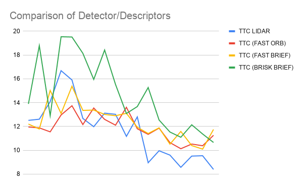

# SFND 3D Object Tracking

## FP.1 Match 3D Objects

We use the following algorithm to match bounding boxes between frames:

1. We loop over bounding boxes in previous frame
2. Find matched keypoints in previous frames
3. Find bounding box in current frame that the matched keypoint belongs to and store this association.
4. Find the bounding box in current frame with the most associated keypoints.

## FP.2 Compute Lidar-based TTC

To compute the TTC we been to find distance to vehicle in previous frame and current frame. 
We calculate this distance by calculating median x-distance for lidar points on vehicle. 
Then we use the constant velocity model to calculate the TTC: `TTC = d1 * delta_t / (d0 - d1)`.

## FP.3 Associate Keypoint Correspondences with Bounding Boxes

We loop through each keypoint and check if it is inside the bounding box in the current frame. 
We remove outliers by removing any points that are 2.5 standard deviations outside the mean euclidean distance.

## FP.4 Compute Camera-based TTC

This code draws heavily from the lesson exercise. It uses distance ratios for keypoints between current and previous frame.
We use the median ratio value to calculate the TTC. The TTC is calculated by the following equation:
```
TTC = - delta_time / (1 - medianRatio)
```

## FP.5 Performance Evaluation 1

Based on visual inspection the lidar TTC looked reasonable. The approach of taking median points has helped with outliers. 
One place where the data could be wrong is at the 3-5 second mark where the vehicle seems to be getting closer but the TTC was increasing; 
that being said, it is hard to visually judge the velocity and since TTC is based on velocity this could be correct. Slower velocities at 
the traffic lights makes this estimation worse.

## FP.6 Performance Evaluation 2

Based on data from the previous project, I experimented with FAST+ORB, FAST+BRIEF and BRISK+BRIEF. 
The following chart shows TTC for each of these detector/descriptor pairs:



FAST+ORB and FAST+BRIEF seem to follow the lidar data best. In terms of computation time, FAST+ORB is the fastest, followed by FAST+BRIEF; 
BRISK+BRIEF was the slowest. 
